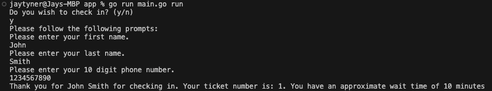

# Service Scheduler

This Go implementation represents a service scheduler designed for an in-person customer service center. The implementation utilizes Cobra, a Go framework, to generate a Command-Line Interface (CLI) for customers to interact with the service scheduler. This idea was implemented to better smiulate a real-world scernario where customers would have the ability to enter the necessary information (First name, last name and phones) themselves. If one wishes to use the service scheduler without the CLI simply comment out everything in the main.go file from line 2-90 and uncomment from line 93-EOF.

## Install Dependencies
Navigate to the service_scheduler folder and install the necessary dependencies as needed using following commands: \
```go get github.com/stretchr/testify``` \
```go get github.com/spf13/cobra```

## Description
The Service Scheduler collects customer-provided information, including first name, last name, and phone number, to facilitate check-ins. There are two tiers of customers: 

1. Regular customers
2. VIP customers 

The Service Scheduler maintains a 2:1 VIP to regular customer processing rate.

## Usage
Enter into /service_scheduler/app folder \


## Implementation

### Part 1: Class Design
***
The implementation consists of two classes: `Customer` and `ServiceScheduler`.

#### Customer Struct

The `Customer` struct represents a customer with attributes such as first name, last name, phone number, and VIP status. It is used to store information about customers checking into the service scheduler. Has three functions NewCustomer(), VIPCheck(), and ValidatePhoneNumber().

| Fields | Description |
| --- | --- | 
|  `FirstName` | A string representing the first name of the customer.
| `LastName` | A string representing the last name of the customer.
| `PhoneNumber` | A string representing the 10 digit phone number of the customer.
|  `IsVIP` | A boolean indicating whether the customer is a VIP (true) or not (false).
| `TicketNum` | A integer representing the ticket a customer receives once checked in.

### NewCustomer(string, string, string) returns (*Customer, error)
The `NewCustomer` function takes in three strings provided in the parameter, validates them. It calls the VIPCheck() to determine whether a customer is a VIP or not. The TicketNum field is left to its default value until the newly created customer has checked in.
  - If the input strings are valid, the function returns a pointer to a new `Customer` object initialized with the provided information and a nil error.
  - If the input strings are invalid, the function returns nil for the `Customer` object pointer along with an error describing the validation failure.

| Parameters | Description |
| --- | --- | 
| `firstName`| A string representing the first name of the customer.
| `lastName` | A string representing the last name of the customer.
| `number`   | A string representing the 10 digit phone number of the customer.

### ValidatePhoneNumber(string) returns bool
The `ValidatePhoneNumber` function takes in a string representing a 10 digit phone number and compares it against an approved regular expression pattern.
- returns true if it matches the regex 
- returns false if it does not match the regex

### VIPCheck() returns (bool)
The `VIPCheck` function simulates a database query that the `service_scheduler` would use to determine if a customer is a VIP. In a real-world scenario, customers would not have the ability to declare themselves as VIPs. Instead, their VIP status would be determined by querying a database or another external source.
- returns true or false at random

#### ServiceScheduler Struct
The `ServiceScheduler` struct represents a scheduler for managing the order of service for customers in an in-person customer service center. It maintains queues for regular and VIP customers, along with a mutex lock for concurrent access control. Additionally, it includes a variable for the VIP processing rate which is vitable for the scheduler to maintain its intended processing rate ratio. Has two functions vital to its functionality, CheckIn() and GetNextCustomer()

| Fields | Description |
| --- | --- | 
| `RegularQueue` | A slice of pointers to `customer.Customer` objects representing the queue for regular customers.
| `VipQueue` | A slice of pointers to `customer.Customer` objects representing the queue for VIP customers.
| `lock` | A mutex lock for ensuring safe concurrent access to the queues.
| `vipRate` | An integer representing the processing rate for VIP customers compared to regular customers. For example, if the VIP rate is 2, then for every 2 VIP customers served, 1 regular customer is served.
| `totalCheckedIn` | An integer representing the total number of customers that have been checked in.


### Part 2: Implementation of CheckIn() and GetNextCustomer()
***
### CheckIn(*Customer)
The `CheckIn` function of the `ServiceScheduler` struct manages the check-in process for customers in a thread-safe operation. It takes a pointer to a `Customer` object as a parameter and adds the customer to the appropriate queue based on their VIP status. Additionally, the function calculates and displays the estimated longest possible wait time (based on the modification done to the GetNextCustomer() for Part 3), and the ticket number for that specific customer. Additionally, the function increments the `totalCheckedIn` by one.

| Parameters | Description |
| --- | ---| 
| `customer` | A pointer to a `customer.Customer` object representing the customer to check in.

### GetNextCustomer() returns *Customer
The `GetNextCustomer` function is a safe concurrent operation used to retrieve the next customer that is to be serviced. For Part 2, all VIP customers receive service ahead of regular customers, regardless of the order in which they enter the service scheduler. However, in cases where a regular customer is currently being serviced and a VIP customer arrives, the regular customer is allowed to finish their service before the VIP customer is attended to.
- returns a pointer to the `Customer` object that was found to be the next customer to be serviced.

### Part 3: Modification of GetNextCustomer() returns *Customer
***
The `GetNextCustomer` function was modified to maintain a 2:1 VIP to regular customer processing rate though still a thread-safe operation. Now instead of ALL VIP customers being serviced ahead of regular customers, for every two VIP customers are served, one regular customer has to be serviced if available.
