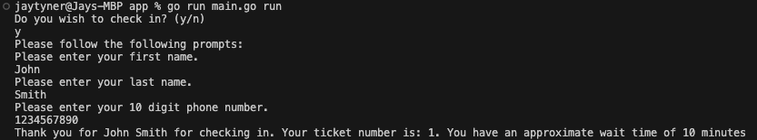

# Service Scheduler

This Go implementation represents a service scheduler designed for an in-person customer service center. The implementation utilizes Cobra, a Go framework, to generate a Command-Line Interface (CLI) for customers to interact with the service scheduler. This idea was implemented to better simulate a real-world scenario where customers would have the ability to enter the necessary information (First name, last name and phone number) themselves. To utilize the service scheduler without the CLI, one can easily do so by commenting out lines 2-90 in the main.go file and uncommenting lines 93 onwards until the end of the file (EOF).

## Install Dependencies
Navigate to the `Service_Scheduler` folder and install the necessary dependencies as needed using following commands: \
```go get github.com/stretchr/testify``` \
```go get github.com/spf13/cobra```

## Description
The `Service_Scheduler` collects customer-provided information, including first name, last name, and phone number, to facilitate check-ins. There are two tiers of customers: 

1. Regular customers
2. VIP customers 

The `Service_Scheduler` maintains a 2:1 VIP to regular customer processing rate.

## Usage
Enter into /service_scheduler/app folder \


## Implementation

### Part 1: Class Design
***
The implementation consists of two classes: `Customer` and `ServiceScheduler`.

#### Customer Struct

The `Customer` struct represents details about a customer, including attributes such as first name, last name, phone number, and VIP status. The struct has three functions NewCustomer(), VIPCheck(), and ValidatePhoneNumber(), each contributing to the creation and validation of instances the `Customer` object.

| Fields | Description |
| --- | --- | 
|  `FirstName` | A string representing the first name of the customer.
| `LastName` | A string representing the last name of the customer.
| `PhoneNumber` | A string representing the 10 digit phone number of the customer.
|  `IsVIP` | A boolean indicating whether the customer is a VIP (true) or not (false).
| `TicketNum` | A integer representing the ticket a customer receives once checked in.

### NewCustomer(string, string, string) returns (*Customer, error)
The `NewCustomer` function accepts three strings provided in the parameters, validates thems, and then calls `VIPCheck()` to determine VIP status of the customer. The `TicketNum` field remains its default value until the newly created customer checks in.
  - If the input strings are valid, the function returns a pointer to a new `Customer` object initialized with the provided information and a nil error.
  - If the input strings are invalid, the function returns nil for the `Customer` object pointer along with an error describing the validation failure.

| Parameters | Description |
| --- | --- | 
| `firstName`| A string representing the first name of the customer.
| `lastName` | A string representing the last name of the customer.
| `number`   | A string representing the 10 digit phone number of the customer.

### ValidatePhoneNumber(string) returns bool
The `ValidatePhoneNumber` function takes in a string representing a 10 digit phone number and compares it against an approved regular expression pattern or regex. This regex allows for flexibility in the phone number's formatting by accepting various patterns, such as with or without parentheses around the first three digits, and allowing for dashes, dots, or spaces as separators between the groups of digits. 
- returns true if it matches the regex 
- returns false if it does not match the regex

### VIPCheck() returns (bool)
The `VIPCheck` function simulates a database query that the `Service_Scheduler` would use to determine if a customer is a VIP. In a real-world scenario, customers typically would not have the ability to declare their VIP status; rather, their VIP status would be determined by querying a database or another external source.
- returns true or false at random

#### ServiceScheduler Struct
The `ServiceScheduler` struct represents a system designed to manage the order customers receive service in an in-person customer service center. It contains two queues for regular and VIP customers, a mutex lock for concurrent access control, a variable `vipRate` that determines the intended processing ratio between VIPs and regular customers and an integer that keeps count of the total number of customers checked in. The struct incorporates two  functions CheckIn() and GetNextCustomer().

| Fields | Description |
| --- | --- | 
| `RegularQueue` | A slice of pointers to `customer.Customer` objects representing the queue for regular customers.
| `VipQueue` | A slice of pointers to `customer.Customer` objects representing the queue for VIP customers.
| `lock` | A mutex lock for ensuring safe concurrent access to the queues.
| `vipRate` | An integer representing the processing rate for VIP customers compared to regular customers. For example, if the VIP rate is 2, then for every 2 VIP customers served, 1 regular customer is served.
| `totalCheckedIn` | An integer representing the total number of customers that have been checked in.


### Part 2: Implementation of CheckIn() and GetNextCustomer()
***
### CheckIn(*Customer)
The `CheckIn` function of the `ServiceScheduler` struct handles the check-in process for customers in a thread-safe way. It accepts a pointer to a `Customer` object as a parameter and adds the customer to the appropriate queue based on their VIP status. Additionally, the function calculates and displays the estimated longest possible wait time (based on the modification done to the GetNextCustomer() for Part 3) and assigns a sequential ticket number for that specific customer. Once the customer has been added the appropriate queue, `totalCheckedIn` is incremented by one.

| Parameters | Description |
| --- | ---| 
| `customer` | A pointer to a `customer.Customer` object representing the customer to check in.

### GetNextCustomer() returns *Customer
The `GetNextCustomer` function is a thread-safe operation designed to retrieve the next customer for service. In Part 2, priority is given to VIP customers, who are served before regular customers, no matter when they checked into the `ServiceScheduler`. However, in situations where a regular customer is already being served and a VIP customer arrives, the regular customer is allowed to complete their service before the VIP customer is attended to.
- returns a pointer to the `Customer` object that was found to be the next customer to be served.

### Part 3: Modification of GetNextCustomer() returns *Customer
***
The `GetNextCustomer` function has been modified to ensure a 2:1 processing ratio between VIP and regular customers while maintaining thread safety. Rather than serving all VIP customers before regular ones, the modification ensures that for every two VIP customers served, one regular customer is served, if available.